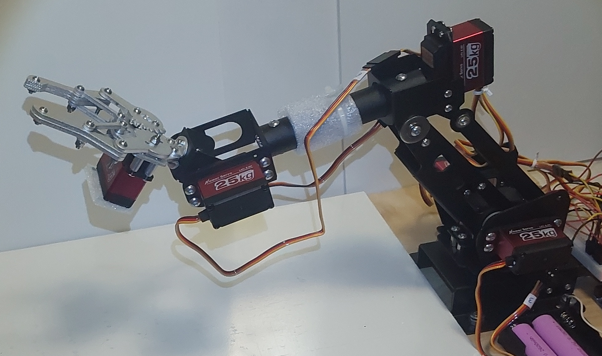
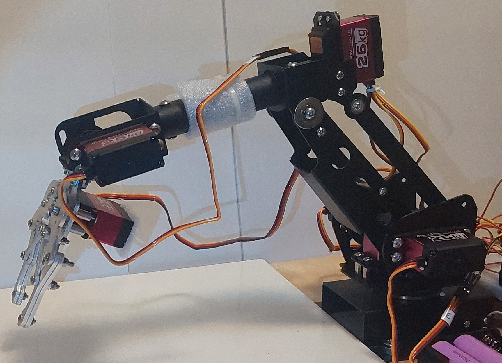

## Эксперименты с мультимодальными LLM, CV и физическим ИИ

Начальный сетап экспериментов опирается на простой манипулятор с 5 степенями свободы и захватом, управляемый с помощью цифровых сервоприводов:

Ракурс №1: 

Ракурс №2: 

### Симуляция

Некоторые задачи на кинематику манипулятора удобно решать не "в живую", а с помощью симулятора, выполняющего геометрические и физические расчеты.
В роли такого симулятора можно взять [PyBullet](https://github.com/bulletphysics/bullet3).
Для симуляции потребуется формальное описание манипулятора - размеры частей, наличие подвижных или неподвижных сочленений, их инерционные свойства.
Стандартным для pybullet подходом является создание URDF файла. Я создал такой файл для используемого манипулятора: [ссылка на URDF файл](KinematicBaseline/arm7.urdf).
Этот файл можно прямо загрузить в небольшом коде:

```python
import pybullet as p
import math


def deg2rad(deg):
    return deg * math.pi / 180.0


def rad2deg(rad):
    return rad * 180.0 / math.pi


def set_arm_degrees(robot_id, degrees):
    """
    degrees: list of 5 joint angles in degrees
    """
    for joint_index, deg in enumerate(degrees):
        rad = deg2rad(deg)
        p.resetJointState(robot_id, joint_index, rad)


p.connect(p.GUI)

# отобразим координатные оси для удобства ориентирования
p.addUserDebugLine([0,0,0],[0.1,0,0],[1,0,0])  # X red
p.addUserDebugLine([0,0,0],[0,0.1,0],[0,1,0])  # Y green
p.addUserDebugLine([0,0,0],[0,0,0.1],[0,0,1])  # Z blue

p.loadURDF("arm7.urdf", useFixedBase=True)


def convert_real2sim(yaw_roll_real, shoulder_tilt_real, elbow_pitch_real, elbow_roll_real, wrist_pitch_real):
    yaw_roll_sim = yaw_roll_real

    shoulder_tilt_sim = shoulder_tilt_real - 90

    elbow_pitch_sim = 90 - elbow_pitch_real + (-shoulder_tilt_sim)

    elbow_roll_sim = elbow_roll_real - 95

    wrist_pitch_sim = 90 - wrist_pitch_real

    return [yaw_roll_sim, shoulder_tilt_sim, elbow_pitch_sim, elbow_roll_sim, wrist_pitch_sim, 0]

sim_degrees = convert_real2sim(yaw_roll_real=90,
                               shoulder_tilt_real=130,
                               elbow_pitch_real=90,
                               elbow_roll_real=90,
                               wrist_pitch_real=145)
set_arm_degrees(0, sim_degrees)

input("Press any key...")
```

В появившемся окошке будет интерактивная симуляция, позволяющая установить камеру в удобный ракурс:


Симулятор позволяет повернуть сервоприводы в заданные углы и получить физические координаты захвата в декартовой системе координат. Используя такой расчет и прогнав таблицу значений углов через симулятор,
можно нахардкодить небольшую проверку работы - см. далее.

### Базовая проверка кинематики


